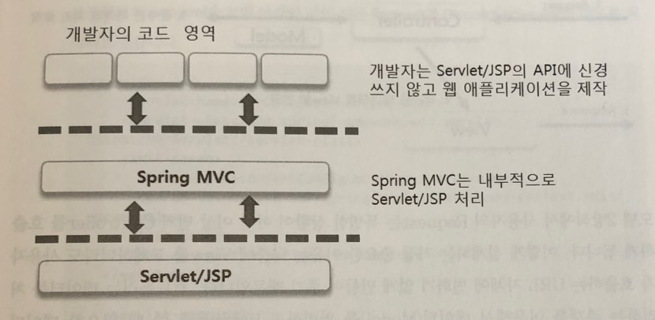

# Spring MVC

### MVC란?

MVC 는 Model, View, Controller의 약자 입니다. 하나의 애플리케이션, 프로젝트를 구성할 때 그 구성요소를 세가지의 역할로 구분한 패턴이다. 

> 출처: 오픈듀토리얼스

### Spring MVC

개발자들이 자신들이 필요한 부분만을 집중해서 개발 할 수 있는 구조로 만들어져 있음.

>  출처: 코드로 배우는 스프링 웹 프로젝트 (개정판)

개발자들을 직접적으로 HttpServletRequest/Response 등과 같이 Servlet/JSP 의 API를 사용할 필요성이 줄어든다.

스프링 2.5버전부터 등장한 어노테이션 방식으로 인해 최근 개발에는 어노테이션, XML 설정만으로도 개발이 가능하게 되었다.

### Spring MVC & Model2

화면과 로직을 분리하는 스타일의 개발방식

>  출처: 코드로 배우는 스프링 웹 프로젝트 (개정판)

Model2 방식에서 사용자의 Request는 특별한 상황이 아닌 이상 Controller를 먼저 호출하게 된다. 

나중에 View 를 교체하더라도 사용자가 호출하는 URL 자체에 변화가 없게 만들어 주기 때문이다.

Controller는 데이터를 처리하는 존재를 이용해서 데이터를 처리하고, Response 할 때 필요한 데이터를 View쪽으로 전달하게 된다.

